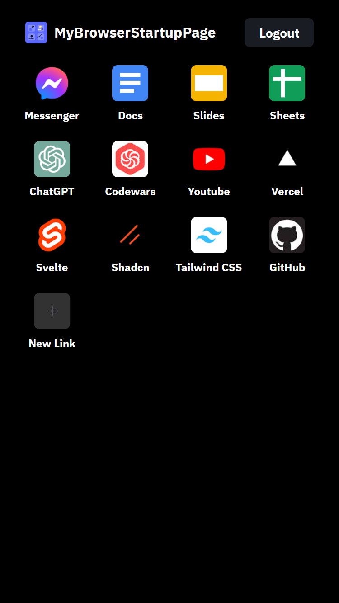

# my-browser-startup-page

Hey there, fellow human! Ever wished your browser's startup page could just get straight to the point? Say no more – we've got you covered.

The minimalist startup page is all about keeping things simple. No more waking up to a chaotic mess of news articles and ads. Instead, picture this: a clean slate, ready for your favorite links and nothing else. It's like your own little corner of the internet, just the way you like it.

Also, you can submit a pull request if you have any improvements or new features in mind!

## How to use it?

It's just like your phone's app page. Drag the icons to reorder, long press or right click on the **text** to edit the link. And that's it.

## Why do I need to set up an account?

That's for synchronization! Yeah, you can totally use the same startup page on your computer and your phone, and it'll all be in sync.

## Tech stack

- Svelte
- SvelteKit
- TailwindCSS
  - Shadcn-svelte
- Firebase
  - Auth
  - Firestore
- Zod
- SortableJS
- Vercel
- Iconify